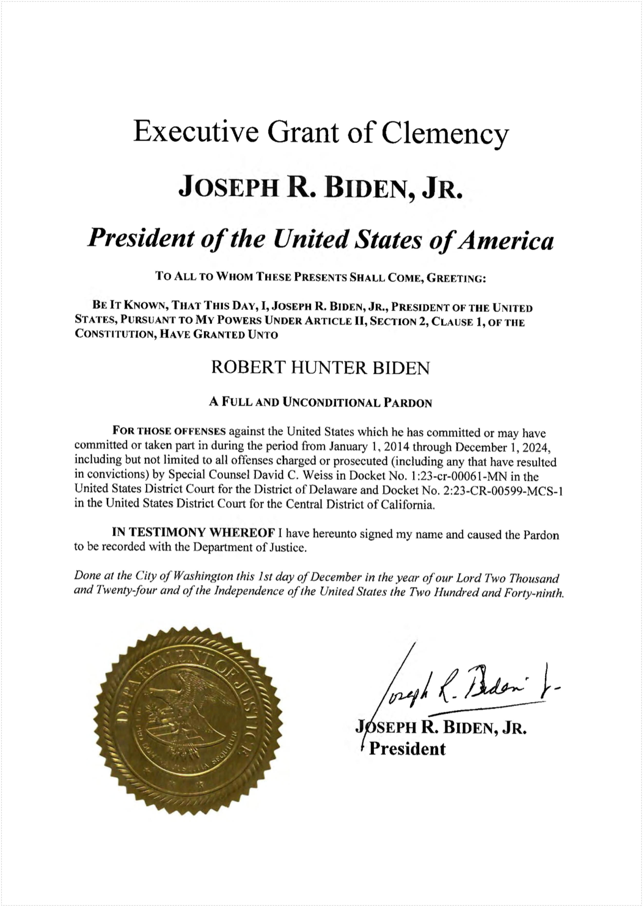
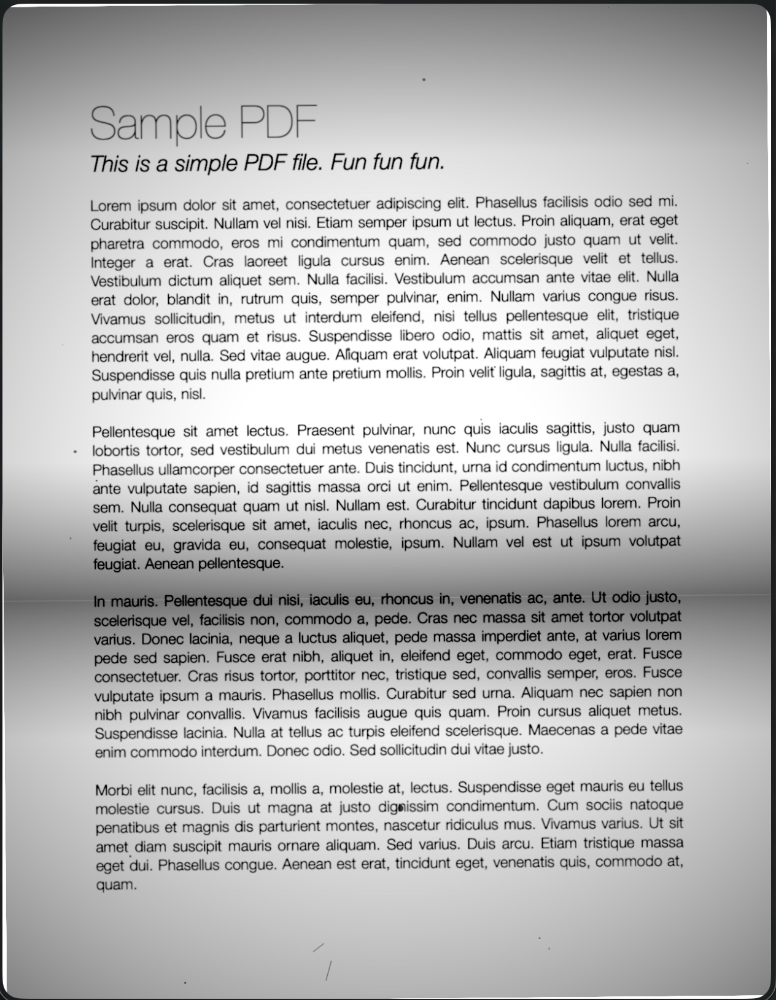

# Scanify

Transform PDF documents to look like scanned documents.

## Examples

### Original


### Default Scan
```bash
scanify input.pdf
```


### All Effects
```bash
scanify --aggressive --bent --dusty input.pdf
```


## Installation

### Homebrew

```bash
brew tap Francium-Tech/tap
brew install scanify
```

### From Source

```bash
git clone https://github.com/Francium-Tech/scanify.git
cd scanify
swift build -c release
cp .build/release/scanify /usr/local/bin/
```

## Usage

```bash
# Basic usage - creates input_scanned.pdf
scanify document.pdf

# Specify output path
scanify document.pdf scanned_output.pdf

# Aggressive mode - more noise, rotation, artifacts
scanify --aggressive document.pdf

# Bent paper effect - shadow band like curved paper
scanify --bent document.pdf

# Dusty scanner - random dust specks and particles
scanify --dusty document.pdf

# Combine options
scanify --aggressive --bent --dusty document.pdf
```

## Options

| Option | Description |
|--------|-------------|
| `--aggressive` | Apply stronger scan effects (more noise, rotation, artifacts) |
| `--bent` | Add paper bend shadow effect (like curved paper under a scanner) |
| `--dusty` | Add random dust specks and hair particles (like a dirty scanner glass) |
| `--version` | Show version |
| `--help` | Show help |

## Effects Applied

### Base Effects (always applied)

| Effect | Description |
|--------|-------------|
| Paper darkening | Whites become slightly gray (scanned paper is never pure white) |
| Edge shadows | Vignette effect from scanner lid |
| Top shadow | Gradient shadow at top edge |
| Uneven lighting | Slightly off-center lighting variation |
| Noise/grain | Paper texture simulation |
| Slight blur | Optical imperfection |
| Random rotation | Paper feed misalignment |
| Saturation reduction | Scanner color limitations |

### Optional Effects

#### `--bent`
Adds a horizontal shadow band across the page to simulate paper that isn't perfectly flat on the scanner glass.

#### `--dusty`
Adds random artifacts to simulate a dirty scanner:
- 15-40 dust specks of varying sizes
- 0-3 thin hair/fiber lines
- Randomly scattered (not uniform)

## Requirements

- macOS 12.0 or later

## License

MIT License - see [LICENSE](LICENSE)
